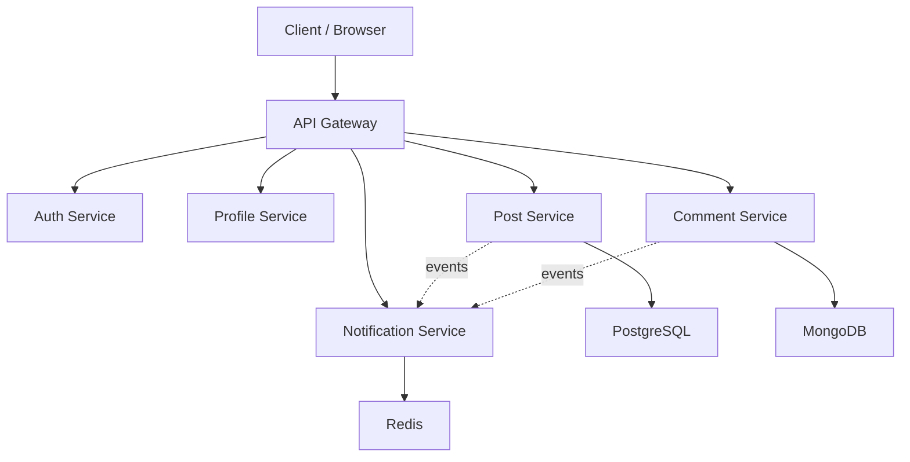

# A4AD Forum Backend

Microservices backend for a modern, lightweight forum — perfect for communities, hobby groups, internal discussions, or open projects.

Built with simplicity, performance, and future scalability in mind.

## 🏗️ Architecture Overview

### Services

| Service                  | Language / Framework      | Database               | Responsibility                                      |
|--------------------------|---------------------------|------------------------|-----------------------------------------------------|
| **api-gateway**          | Go + Fiber                | —                      | Single entry point, JWT validation, rate limiting, CORS |
| **auth-service**         | Java + Spring Boot        | PostgreSQL             | Registration, login, JWT, roles (user/mod/admin)    |
| **profile-service**      | Go                        | PostgreSQL             | User profiles, avatars, bio, stats (posts, comments, reputation) |
| **post-service**         | Go                        | PostgreSQL             | Posts CRUD, view/like/comment counters              |
| **comment-service**      | NestJS + TypeScript       | MongoDB                | Threaded comments, replies, likes                   |
| **notification-service** | NestJS + TypeScript       | Redis + PostgreSQL/MongoDB | Notifications (comments, replies, likes, mentions) |

### High-level Flow



### 🚀 Quick Start

Requirements

Git (with submodule support)
Docker + Docker Compose
Go 1.23+
Java 21 + Maven
Node.js 18+ + npm

### Repository Structure

Submodule-based layout — each service lives in its own repository.

```bash
forum-backend/
├── .gitmodules
├── api-gateway/
├── auth-service/
├── profile-service/
├── post-service/
├── comment-service/
├── notification-service/
├── docker-compose.yml
└── README.md
```

### Setup Steps

1. Clone with submodules

```bash
git clone --recurse-submodules https://github.com/A4AD-team/forum-backend.git
cd forum-backend
```

2. Start infrastructure

```bash
docker compose up -d postgres mongodb redis
```

3. Install dependencies (run in each service folder)
   
   Go services:

   ```bash
   cd api-gateway && go mod download
   cd ../profile-service && go mod download
   cd ../post-service && go mod download
   ```

   Java:

   ```bash
   cd ../auth-service && mvn clean install
   ```

   TypeScript:

   ```bash
   cd ../comment-service && npm install
   cd ../notification-service && npm install
   ```

4. Run everything

```bash
docker compose up
```

API available at: <http://localhost:8080>
