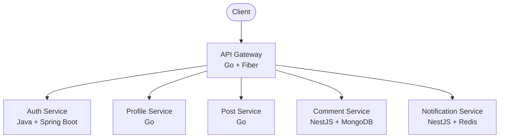

# A4AD Forum Backend

> Modern, lightweight, and scalable forum platform built with microservices architecture

[](https://go.dev/)
[](https://openjdk.org/)
[](https://nestjs.com/)
[](LICENSE)
[]()

---

## 📚 Documentation / Документация

Choose your preferred language / Выберите предпочитаемый язык:

- **[🇬🇧 English Documentation](README_EN.md)** — Complete documentation in English
- **[🇷🇺 Русская документация](README_RU.md)** — Полная документация на русском языке

---

## 🏗️ Architecture Overview



---

## 🚀 Quick Start

```bash
# Clone with submodules
git clone --recurse-submodules https://github.com/A4AD-team/forum-backend.git
cd forum-backend

# Start infrastructure
docker compose up -d

# API will be available at http://localhost:8080
```

---

## 📁 Services

| Service | Tech | Port | Description |
|---------|------|------|-------------|
| [api-gateway](api-gateway/) | Go + Fiber | 8080 | API Gateway |
| [auth-service](auth-service/) | Java + Spring Boot | 8081 | Authentication |
| [profile-service](profile-service/) | Go | 8082 | User Profiles |
| [post-service](post-service/) | Go | 8083 | Posts Management |
| [comment-service](comment-service/) | NestJS + MongoDB | 8084 | Comments |
| [notification-service](notification-service/) | NestJS + Redis | 8085 | Notifications |

---

## 📄 License

MIT License — see [LICENSE](LICENSE) file for details.

---

<p align="center">
  <strong>Built with ❤️ by A4AD Team</strong>
</p>
