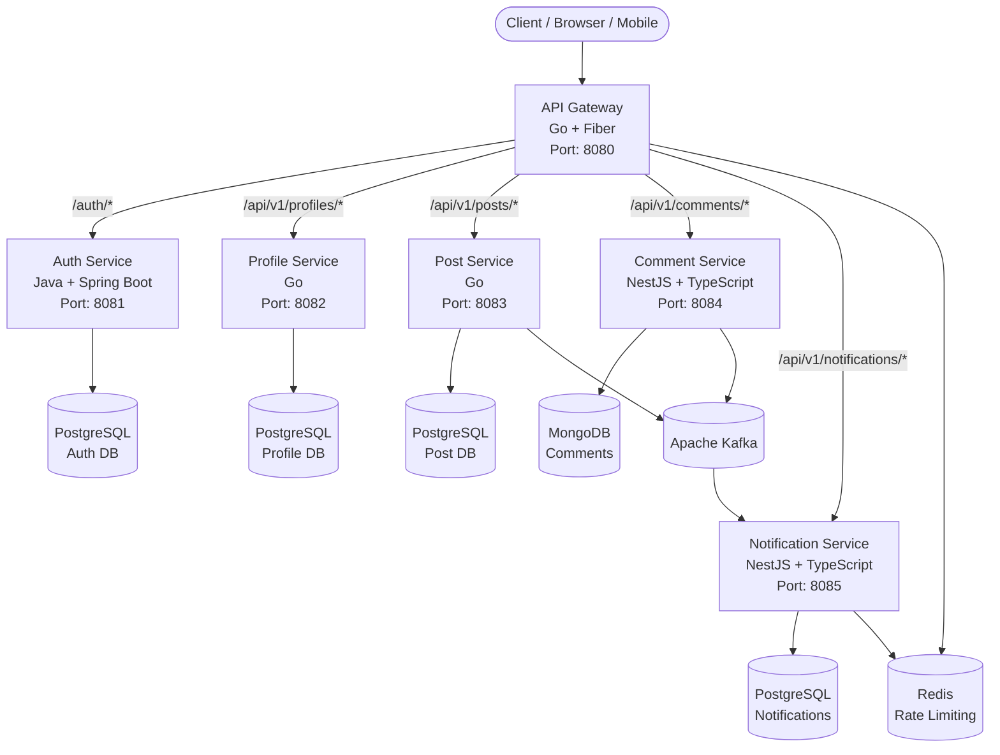

<p align="center">
  
</p>

<p align="center">
  
  
  
  
  
  
  
</p>

---

## 📝 Overview

**A4AD Forum** is a modern, lightweight, and scalable forum platform built with microservices architecture. Designed for communities, hobby groups, internal discussions, or open projects — it combines simplicity, performance, and future scalability.

This is the **Backend Repository** containing all microservices that power the A4AD Forum platform.

---

## ✨ Features

- 🔐 **Authentication & Authorization** — JWT-based auth with role-based access control (user, moderator, admin)
- 👤 **User Profiles** — Customizable profiles with avatars, bios, and activity statistics
- 📝 **Posts & Threads** — Create, edit, and manage forum posts with rich content
- 💬 **Comments & Replies** — Nested comment threads with tree structure support
- 👍 **Engagement System** — Like posts and comments, track view counts
- 🔔 **Real-time Notifications** — Get notified about replies, likes, and mentions
- 🔍 **Search & Discovery** — Full-text search for posts and user discovery
- 📊 **Analytics** — Track user reputation, post views, and community engagement
- 🚀 **High Performance** — Optimized for speed with caching and efficient queries
- 🐳 **Containerized** — Docker and Docker Compose support for easy deployment

---

## 🛠 Tech Stack

### Backend Services

| Service | Language | Framework | Database | Responsibility |
|---------|----------|-----------|----------|----------------|
| **API Gateway** | Go 1.23+ | Fiber | — | JWT validation, rate limiting, routing |
| **Auth Service** | Java 21 | Spring Boot 3.3+ | PostgreSQL | User auth, JWT, roles & permissions |
| **Profile Service** | Go 1.23+ | Standard Library | PostgreSQL | User profiles, avatars, statistics |
| **Post Service** | Go 1.23+ | Standard Library | PostgreSQL | Posts CRUD, counters, pagination |
| **Comment Service** | TypeScript | NestJS 10+ | MongoDB | Threaded comments, replies, likes |
| **Notification Service** | TypeScript | NestJS 10+ | Redis + PostgreSQL | Real-time notifications |

### Infrastructure

- **Message Broker:** Apache Kafka
- **Cache:** Redis 7+
- **Containerization:** Docker & Docker Compose
- **API Documentation:** Swagger/OpenAPI
- **Monitoring:** Prometheus + Grafana
- **Logging:** Structured logging with correlation IDs

---

## 📊 Architecture



---

## 🚀 Quick Start

### Prerequisites

- Docker & Docker Compose
- Git with submodule support
- Make (optional, for convenience commands)

### Installation

1. **Clone the repository with all submodules:**
   ```bash
   git clone --recurse-submodules https://github.com/A4AD-team/forum-backend.git
   cd forum-backend
   ```

2. **Initialize and update submodules (if not done during clone):**
   ```bash
   git submodule update --init --recursive
   ```

3. **Start all infrastructure services:**
   ```bash
   docker compose up -d postgres mongodb redis kafka zookeeper
   ```

4. **Install dependencies for each service:**

   **Go services:**
   ```bash
   cd api-gateway && go mod download && cd ..
   cd profile-service && go mod download && cd ..
   cd post-service && go mod download && cd ..
   ```

   **Java service:**
   ```bash
   cd auth-service && mvn clean install -DskipTests && cd ..
   ```

   **TypeScript services:**
   ```bash
   cd comment-service && pnpm install && cd ..
   cd notification-service && pnpm install && cd ..
   ```

5. **Run database migrations:**
   ```bash
   # Auth Service
   cd auth-service && mvn liquibase:update && cd ..
   
   # Profile Service
   cd profile-service && make migrate-up && cd ..
   
   # Post Service
   cd post-service && make migrate-up && cd ..
   ```

6. **Start all services:**
   
   Using Docker Compose (recommended for development):
   ```bash
   docker compose up -d
   ```
   
   Or manually start each service (see individual service READMEs for details).

7. **Verify everything is running:**
   ```bash
   curl http://localhost:8080/health
   ```

The API will be available at `http://localhost:8080`

---

## 📁 Project Structure

```
forum-backend/
├── api-gateway/              # Go + Fiber - API Gateway
│   ├── cmd/gateway/
│   ├── internal/
│   ├── README_EN.md
│   ├── README_RU.md
│   └── Dockerfile
├── auth-service/             # Java + Spring Boot - Authentication
│   ├── src/
│   ├── README_EN.md
│   ├── README_RU.md
│   ├── pom.xml
│   └── Dockerfile
├── profile-service/          # Go - User Profiles
│   ├── cmd/server/
│   ├── internal/
│   ├── README_EN.md
│   ├── README_RU.md
│   └── Dockerfile
├── post-service/             # Go - Posts Management
│   ├── cmd/server/
│   ├── internal/
│   ├── README_EN.md
│   ├── README_RU.md
│   └── Dockerfile
├── comment-service/          # NestJS + TypeScript - Comments
│   ├── src/
│   ├── test/
│   ├── README_EN.md
│   ├── README_RU.md
│   └── Dockerfile
├── notification-service/     # NestJS + TypeScript - Notifications
│   ├── src/
│   ├── test/
│   ├── README_EN.md
│   ├── README_RU.md
│   └── Dockerfile
├── docker-compose.yml        # Full stack orchestration
├── .gitmodules              # Git submodule configuration
├── README_EN.md             # This file (English)
├── README_RU.md             # Russian version
└── LICENSE                  # MIT License
```

---

## 🔧 Environment Variables

### Global Configuration

| Variable | Description | Default | Required |
|----------|-------------|---------|----------|
| `APP_ENV` | Environment mode | `development` | No |
| `LOG_LEVEL` | Global logging level | `info` | No |

### Database Configuration

| Variable | Description | Default | Required |
|----------|-------------|---------|----------|
| `POSTGRES_HOST` | PostgreSQL hostname | `localhost` | Yes |
| `POSTGRES_PORT` | PostgreSQL port | `5432` | No |
| `POSTGRES_USER` | PostgreSQL username | `postgres` | Yes |
| `POSTGRES_PASSWORD` | PostgreSQL password | `` | Yes |
| `MONGODB_URI` | MongoDB connection string | `mongodb://localhost:27017` | Yes |
| `REDIS_HOST` | Redis hostname | `localhost` | Yes |
| `REDIS_PORT` | Redis port | `6379` | No |

### Kafka Configuration

| Variable | Description | Default | Required |
|----------|-------------|---------|----------|
| `KAFKA_BROKERS` | Kafka broker addresses | `localhost:9092` | Yes |
| `KAFKA_CLIENT_ID` | Kafka client ID | `forum-backend` | No |

### JWT Configuration

| Variable | Description | Default | Required |
|----------|-------------|---------|----------|
| `JWT_SECRET` | JWT signing secret | `` | Yes |
| `JWT_ACCESS_EXPIRATION` | Access token TTL (minutes) | `15` | No |
| `JWT_REFRESH_EXPIRATION` | Refresh token TTL (days) | `7` | No |

See individual service READMEs for service-specific environment variables.

---

## 📡 API Endpoints

All API requests go through the **API Gateway** at `http://localhost:8080`

### Authentication

| Method | Path | Description | Auth Required |
|--------|------|-------------|---------------|
| `POST` | `/auth/sign-up` | Register new account | No |
| `POST` | `/auth/sign-in` | Login and get tokens | No |
| `POST` | `/auth/refresh` | Refresh access token | No |
| `POST` | `/auth/sign-out` | Logout | Yes |

### Posts

| Method | Path | Description | Auth Required |
|--------|------|-------------|---------------|
| `GET` | `/api/v1/posts` | List posts | No |
| `POST` | `/api/v1/posts` | Create post | Yes |
| `GET` | `/api/v1/posts/:id` | Get post details | No |
| `PATCH` | `/api/v1/posts/:id` | Update post | Yes |
| `DELETE` | `/api/v1/posts/:id` | Delete post | Yes |
| `POST` | `/api/v1/posts/:id/like` | Like post | Yes |

### Comments

| Method | Path | Description | Auth Required |
|--------|------|-------------|---------------|
| `GET` | `/api/v1/comments?postId=:id` | List comments | No |
| `POST` | `/api/v1/comments` | Create comment | Yes |
| `PATCH` | `/api/v1/comments/:id` | Update comment | Yes |
| `DELETE` | `/api/v1/comments/:id` | Delete comment | Yes |
| `POST` | `/api/v1/comments/:id/like` | Like comment | Yes |

### Profiles

| Method | Path | Description | Auth Required |
|--------|------|-------------|---------------|
| `GET` | `/api/v1/profiles/:username` | Get profile | No |
| `GET` | `/api/v1/profiles/me` | Get my profile | Yes |
| `PATCH` | `/api/v1/profiles/me` | Update profile | Yes |

### Notifications

| Method | Path | Description | Auth Required |
|--------|------|-------------|---------------|
| `GET` | `/api/v1/notifications` | List notifications | Yes |
| `PATCH` | `/api/v1/notifications/:id/read` | Mark as read | Yes |

---

## 🩺 Health Checks

| Service | Endpoint | Description |
|---------|----------|-------------|
| API Gateway | `GET /health` | Overall system health |
| Auth Service | `GET /actuator/health` | Spring Boot health |
| Profile Service | `GET /health` | Service health |
| Post Service | `GET /health` | Service health |
| Comment Service | `GET /health` | Service health |
| Notification Service | `GET /health` | Service health |

---

## 🧪 Testing

Each service has its own test suite. See individual service READMEs for detailed testing instructions.

```bash
# Run all tests across all services
make test-all

# Or run tests per service:
cd api-gateway && go test ./...
cd auth-service && mvn test
cd comment-service && pnpm test
cd notification-service && pnpm test
```

---

## 🤝 Contributing

We welcome contributions! Please see our [Contributing Guide](CONTRIBUTING.md) for details.

1. Fork the repository
2. Create your feature branch (`git checkout -b feature/amazing-feature`)
3. Commit your changes (`git commit -m 'feat: add amazing feature'`)
4. Push to the branch (`git push origin feature/amazing-feature`)
5. Open a Pull Request

---

## 📄 License

This project is licensed under the MIT License — see the [LICENSE](LICENSE) file for details.

---

## 🔗 Links

- [API Documentation](http://localhost:8080/api/docs) (when running locally)
- [Project Board](https://github.com/orgs/A4AD-team/projects)
- [Issues](https://github.com/A4AD-team/forum-backend/issues)

---

<p align="center">
  <strong>Built with ❤️ by A4AD Team</strong>
</p>

<p align="center">
  <a href="README_RU.md">🇷🇺 Русская версия</a>
</p>
