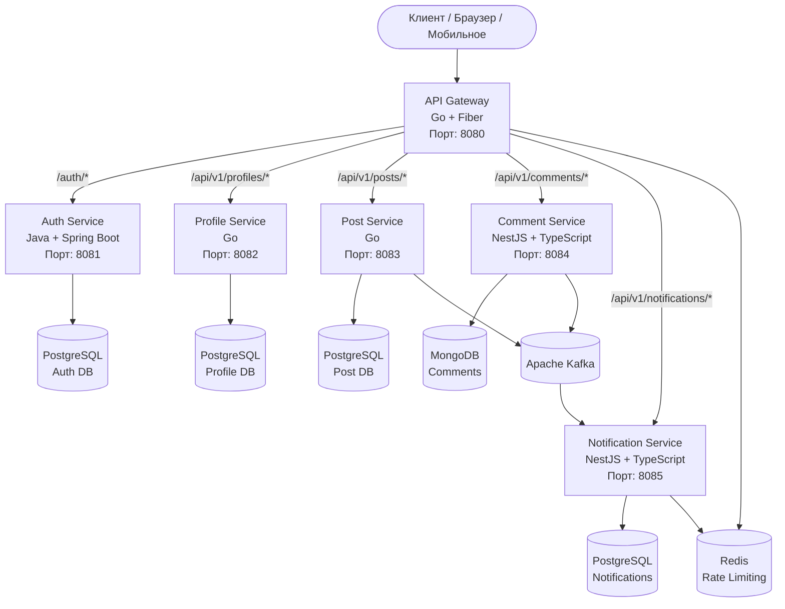

<p align="center">
  
</p>

<p align="center">
  
  
  
  
  
  
  
</p>

---

## 📝 Описание

**A4AD Forum** — это современная, лёгкая и масштабируемая платформа форума, построенная на микросервисной архитектуре. Разработана для сообществ, хобби-групп, внутренних обсуждений или открытых проектов — сочетает простоту, производительность и возможность масштабирования.

Это **репозиторий бэкенда**, содержащий все микросервисы, обеспечивающие работу платформы A4AD Forum.

---

## ✨ Возможности

- 🔐 **Аутентификация и авторизация** — Аутентификация на основе JWT с ролевым доступом (user, moderator, admin)
- 👤 **Профили пользователей** — Настраиваемые профили с аватарами, биографией и статистикой активности
- 📝 **Посты и ветки** — Создание, редактирование и управление постами с богатым содержимым
- 💬 **Комментарии и ответы** — Вложенные ветки комментариев с поддержкой древовидной структуры
- 👍 **Система вовлечённости** — Лайки постов и комментариев, отслеживание просмотров
- 🔔 **Уведомления в реальном времени** — Получайте уведомления об ответах, лайках и упоминаниях
- 🔍 **Поиск и обнаружение** — Полнотекстовый поиск постов и обнаружение пользователей
- 📊 **Аналитика** — Отслеживание репутации пользователей, просмотров постов и вовлечённости сообщества
- 🚀 **Высокая производительность** — Оптимизировано для скорости с кешированием и эффективными запросами
- 🐳 **Контейнеризация** — Поддержка Docker и Docker Compose для удобного развёртывания

---

## 🛠 Технологический стек

### Бэкенд-сервисы

| Сервис | Язык | Фреймворк | База данных | Назначение |
|--------|------|-----------|-------------|------------|
| **API Gateway** | Go 1.23+ | Fiber | — | JWT-валидация, rate limiting, маршрутизация |
| **Auth Service** | Java 21 | Spring Boot 3.3+ | PostgreSQL | Аутентификация, JWT, роли и разрешения |
| **Profile Service** | Go 1.23+ | Стандартная библиотека | PostgreSQL | Профили пользователей, аватары, статистика |
| **Post Service** | Go 1.23+ | Стандартная библиотека | PostgreSQL | CRUD постов, счётчики, пагинация |
| **Comment Service** | TypeScript | NestJS 10+ | MongoDB | Древовидные комментарии, ответы, лайки |
| **Notification Service** | TypeScript | NestJS 10+ | Redis + PostgreSQL | Уведомления в реальном времени |

### Инфраструктура

- **Брокер сообщений:** Apache Kafka
- **Кеш:** Redis 7+
- **Контейнеризация:** Docker & Docker Compose
- **Документация API:** Swagger/OpenAPI
- **Мониторинг:** Prometheus + Grafana
- **Логирование:** Структурированное логирование с correlation ID

---

## 📊 Архитектура



---

## 🚀 Быстрый старт

### Требования

- Docker & Docker Compose
- Git с поддержкой submodules
- Make (опционально, для удобных команд)

### Установка

1. **Клонирование репозитория со всеми submodules:**
   ```bash
   git clone --recurse-submodules https://github.com/A4AD-team/forum-backend.git
   cd forum-backend
   ```

2. **Инициализация и обновление submodules (если не выполнено при клонировании):**
   ```bash
   git submodule update --init --recursive
   ```

3. **Запуск всех сервисов инфраструктуры:**
   ```bash
   docker compose up -d postgres mongodb redis kafka zookeeper
   ```

4. **Установка зависимостей для каждого сервиса:**

   **Go-сервисы:**
   ```bash
   cd api-gateway && go mod download && cd ..
   cd profile-service && go mod download && cd ..
   cd post-service && go mod download && cd ..
   ```

   **Java-сервис:**
   ```bash
   cd auth-service && mvn clean install -DskipTests && cd ..
   ```

   **TypeScript-сервисы:**
   ```bash
   cd comment-service && pnpm install && cd ..
   cd notification-service && pnpm install && cd ..
   ```

5. **Выполнение миграций баз данных:**
   ```bash
   # Auth Service
   cd auth-service && mvn liquibase:update && cd ..
   
   # Profile Service
   cd profile-service && make migrate-up && cd ..
   
   # Post Service
   cd post-service && make migrate-up && cd ..
   ```

6. **Запуск всех сервисов:**
   
   С использованием Docker Compose (рекомендуется для разработки):
   ```bash
   docker compose up -d
   ```
   
   Или запуск каждого сервиса вручную (подробности в README отдельных сервисов).

7. **Проверка работоспособности:**
   ```bash
   curl http://localhost:8080/health
   ```

API будет доступен по адресу `http://localhost:8080`

---

## 📁 Структура проекта

```
forum-backend/
├── api-gateway/              # Go + Fiber - API Gateway
│   ├── cmd/gateway/
│   ├── internal/
│   ├── README_EN.md
│   ├── README_RU.md
│   └── Dockerfile
├── auth-service/             # Java + Spring Boot - Аутентификация
│   ├── src/
│   ├── README_EN.md
│   ├── README_RU.md
│   ├── pom.xml
│   └── Dockerfile
├── profile-service/          # Go - Профили пользователей
│   ├── cmd/server/
│   ├── internal/
│   ├── README_EN.md
│   ├── README_RU.md
│   └── Dockerfile
├── post-service/             # Go - Управление постами
│   ├── cmd/server/
│   ├── internal/
│   ├── README_EN.md
│   ├── README_RU.md
│   └── Dockerfile
├── comment-service/          # NestJS + TypeScript - Комментарии
│   ├── src/
│   ├── test/
│   ├── README_EN.md
│   ├── README_RU.md
│   └── Dockerfile
├── notification-service/     # NestJS + TypeScript - Уведомления
│   ├── src/
│   ├── test/
│   ├── README_EN.md
│   ├── README_RU.md
│   └── Dockerfile
├── docker-compose.yml        # Оркестрация всего стека
├── .gitmodules              # Конфигурация Git submodules
├── README_EN.md             # Этот файл (English)
├── README_RU.md             # Русская версия
└── LICENSE                  # Лицензия MIT
```

---

## 🔧 Переменные окружения

### Глобальная конфигурация

| Переменная | Описание | Значение по умолчанию | Обязательная |
|------------|----------|----------------------|--------------|
| `APP_ENV` | Режим окружения | `development` | Нет |
| `LOG_LEVEL` | Глобальный уровень логирования | `info` | Нет |

### Конфигурация баз данных

| Переменная | Описание | Значение по умолчанию | Обязательная |
|------------|----------|----------------------|--------------|
| `POSTGRES_HOST` | Хост PostgreSQL | `localhost` | Да |
| `POSTGRES_PORT` | Порт PostgreSQL | `5432` | Нет |
| `POSTGRES_USER` | Имя пользователя PostgreSQL | `postgres` | Да |
| `POSTGRES_PASSWORD` | Пароль PostgreSQL | `` | Да |
| `MONGODB_URI` | Строка подключения MongoDB | `mongodb://localhost:27017` | Да |
| `REDIS_HOST` | Хост Redis | `localhost` | Да |
| `REDIS_PORT` | Порт Redis | `6379` | Нет |

### Конфигурация Kafka

| Переменная | Описание | Значение по умолчанию | Обязательная |
|------------|----------|----------------------|--------------|
| `KAFKA_BROKERS` | Адреса брокеров Kafka | `localhost:9092` | Да |
| `KAFKA_CLIENT_ID` | ID клиента Kafka | `forum-backend` | Нет |

### Конфигурация JWT

| Переменная | Описание | Значение по умолчанию | Обязательная |
|------------|----------|----------------------|--------------|
| `JWT_SECRET` | Секрет для подписи JWT | `` | Да |
| `JWT_ACCESS_EXPIRATION` | TTL access-токена (минуты) | `15` | Нет |
| `JWT_REFRESH_EXPIRATION` | TTL refresh-токена (дни) | `7` | Нет |

Смотрите README отдельных сервисов для специфичных переменных окружения.

---

## 📡 Эндпоинты

Все API-запросы проходят через **API Gateway** по адресу `http://localhost:8080`

### Аутентификация

| Метод | Путь | Описание | Требуется авторизация |
|-------|------|----------|----------------------|
| `POST` | `/auth/sign-up` | Регистрация нового аккаунта | Нет |
| `POST` | `/auth/sign-in` | Вход и получение токенов | Нет |
| `POST` | `/auth/refresh` | Обновление access-токена | Нет |
| `POST` | `/auth/sign-out` | Выход | Да |

### Посты

| Метод | Путь | Описание | Требуется авторизация |
|-------|------|----------|----------------------|
| `GET` | `/api/v1/posts` | Список постов | Нет |
| `POST` | `/api/v1/posts` | Создать пост | Да |
| `GET` | `/api/v1/posts/:id` | Детали поста | Нет |
| `PATCH` | `/api/v1/posts/:id` | Обновить пост | Да |
| `DELETE` | `/api/v1/posts/:id` | Удалить пост | Да |
| `POST` | `/api/v1/posts/:id/like` | Лайкнуть пост | Да |

### Комментарии

| Метод | Путь | Описание | Требуется авторизация |
|-------|------|----------|----------------------|
| `GET` | `/api/v1/comments?postId=:id` | Список комментариев | Нет |
| `POST` | `/api/v1/comments` | Создать комментарий | Да |
| `PATCH` | `/api/v1/comments/:id` | Обновить комментарий | Да |
| `DELETE` | `/api/v1/comments/:id` | Удалить комментарий | Да |
| `POST` | `/api/v1/comments/:id/like` | Лайкнуть комментарий | Да |

### Профили

| Метод | Путь | Описание | Требуется авторизация |
|-------|------|----------|----------------------|
| `GET` | `/api/v1/profiles/:username` | Получить профиль | Нет |
| `GET` | `/api/v1/profiles/me` | Получить мой профиль | Да |
| `PATCH` | `/api/v1/profiles/me` | Обновить профиль | Да |

### Уведомления

| Метод | Путь | Описание | Требуется авторизация |
|-------|------|----------|----------------------|
| `GET` | `/api/v1/notifications` | Список уведомлений | Да |
| `PATCH` | `/api/v1/notifications/:id/read` | Отметить прочитанным | Да |

---

## 🩺 Health Checks

| Сервис | Эндпоинт | Описание |
|--------|----------|----------|
| API Gateway | `GET /health` | Общее состояние системы |
| Auth Service | `GET /actuator/health` | Spring Boot health |
| Profile Service | `GET /health` | Состояние сервиса |
| Post Service | `GET /health` | Состояние сервиса |
| Comment Service | `GET /health` | Состояние сервиса |
| Notification Service | `GET /health` | Состояние сервиса |

---

## 🧪 Тестирование

Каждый сервис имеет свой набор тестов. Подробности в README отдельных сервисов.

```bash
# Запуск всех тестов во всех сервисах
make test-all

# Или запуск тестов по сервисам:
cd api-gateway && go test ./...
cd auth-service && mvn test
cd comment-service && pnpm test
cd notification-service && pnpm test
```

---

## 🤝 Вклад в проект

Мы приветствуем вклад в проект! Пожалуйста, ознакомьтесь с нашим [Руководством по внесению вклада](CONTRIBUTING.md).

1. Сделайте форк репозитория
2. Создайте ветку для функции (`git checkout -b feature/amazing-feature`)
3. Зафиксируйте изменения (`git commit -m 'feat: add amazing feature'`)
4. Отправьте изменения (`git push origin feature/amazing-feature`)
5. Откройте Pull Request

---

## 📄 Лицензия

Проект распространяется под лицензией MIT — подробности в файле [LICENSE](LICENSE).

---

## 🔗 Ссылки

- [Документация API](http://localhost:8080/api/docs) (при локальном запуске)
- [Проектная доска](https://github.com/orgs/A4AD-team/projects)
- [Issues](https://github.com/A4AD-team/forum-backend/issues)

---

<p align="center">
  <strong>Создано с ❤️ командой A4AD</strong>
</p>

<p align="center">
  <a href="README_EN.md">🇬🇧 English version</a>
</p>
